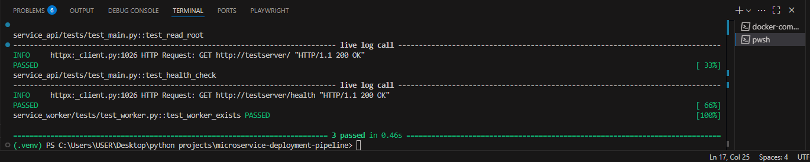

# ⚡ Microservice Deployment Pipeline

A modern **microservice architecture** built with **FastAPI**, **background workers**, and **PostgreSQL**, all orchestrated with **Docker Compose** and a **CI/CD pipeline using GitHub Actions**.

This project is designed to showcase:
- **API-first design** (FastAPI microservice).
- **Worker processes** for background tasks.
- **Database integration** (PostgreSQL).
- **Automated testing** with Pytest.
- **Continuous Integration and Deployment** (CI/CD) with Docker and GitHub Actions.

## **📸 Screenshots**

### **Pytest results**



## **📂 Project Structure**
```bash
microservice-deployment-pipeline/
│
├── service_api/                 # REST API microservice
│   ├── app/                     # API source code
│   │   ├── __init__.py
│   │   └── main.py
│   ├── requirements.txt
│   ├── Dockerfile
│   └── tests/                   # Pytest tests for API
│       └── test_main.py
│
├── service_worker/              # Background worker service
│   ├── worker/
│   │   └── task_runner.py
│   ├── requirements.txt
│   ├── Dockerfile
│   └── tests/
│       └── test_worker.py
│
├── docker-compose.yml           # Orchestrates API + Worker + DB
├── .github/
│   └── workflows/
│       └── ci_cd.yml            # GitHub Actions CI/CD pipeline
├── pytest.ini                   # Test configuration
└── README.md
```

## **🚀 Features**
- **FastAPI microservice** with health-check endpoints.
- **Background worker** (simulating queue/task processing).
- **PostgreSQL database** running as a container.
- **Docker & docker-compose** for multi-container orchestration.
- **CI/CD** pipeline that:
  - Installs dependencies.
  - Runs all tests.
  - Builds Docker images.
  - Pushes images to Docker Hub.

## **🔧 How to Run**

### **Run locally (API only)**
```bash
cd service_api
pip install -r requirements.txt
uvicorn app.main:app --reload
```
The API will be available at http://localhost:8000

### **Run everything with Docker**

Make sure Docker Desktop is running, then:

```bash
docker-compose up --build
```
Services:

- API: http://localhost:8000

- Worker: Runs in background (logs visible in terminal).

- Database: PostgreSQL on localhost:5432 (user: user, pass: password).

## Run Tests
```bash
pytest
#This will execute all tests in both service_api and service_worker.
```

## **📦 CI/CD Pipeline**
The pipeline in `.github/workflows/ci_cd.yml` will:
1. Run unit tests on every push.
2. Build Docker images for both the API and the Worker.
3. Push the images to Docker Hub (when secrets `DOCKER_USERNAME` and `DOCKER_PASSWORD` are configured).

## **🔥 Why This Project Rocks**

This repository is a **production-ready template** for building modern microservice-based applications. It demonstrates:

- **Clean separation of concerns** – each service (API, worker, database) has its own responsibility.
- **Scalable architecture** – easily extendable by adding new microservices or components.
- **Automated testing & CI/CD** – ensures quality with Pytest and seamless deployments through GitHub Actions.
- **Battle-tested tech stack** – built using FastAPI, Docker, PostgreSQL, and other real-world tools.

**Examples of apps with similar architecture:**  
- **Uber/Didi** – APIs handle ride requests while background workers process payments and notifications.  
- **Spotify** – APIs serve playlists and user data, while workers manage recommendations and heavy data processing.  
- **Amazon** – separate services for cart management, product catalog, and payment workflows.

## **🛠 Tech Stack**
- **FastAPI** – for the REST API.
- **Pytest** – for testing.
- **PostgreSQL** – database container.
- **Docker & docker-compose** – container orchestration.
- **GitHub Actions** – CI/CD automation.


## **📜 License**
This project is MIT licensed – free to use and adapt.

## **📬 Contact**

If you have any questions, feedback, or collaboration ideas, feel free to reach out:

- **GitHub:** [eduardogallifaochoa](https://github.com/eduardogallifaochoa)
- **Email:** eduardogallifao@gmail.com
- **LinkedIn:** [Eduardo Gallifa Ochoa](https://www.linkedin.com/in/eduardogallifaochoa/)